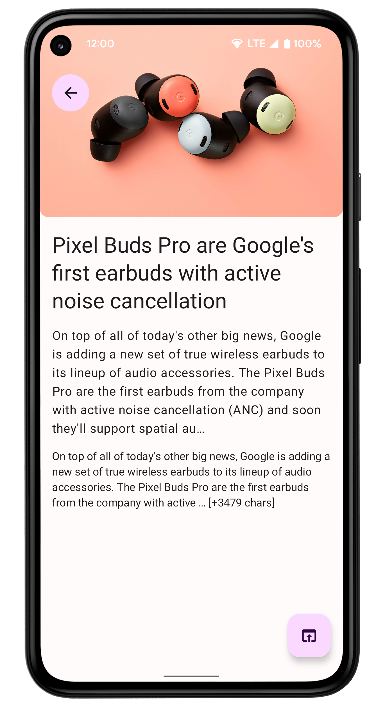

# Compose Based Android Sample

## Screenshots

### Main screens

|Headlines                     |Search                       |
|:----------------------------:|:---------------------------:|
|||

|About                        |Article details              |
|:---------------------------:|:---------------------------:|
|||

### Theiming

|Light Theme                   |Dark Theme                   |
|:----------------------------:|:---------------------------:|
||| 

### Material You

|                              |                             |                             |
|------------------------------|-----------------------------|-----------------------------|
||||

### Debug Drawer

|                              |
|:----------------------------:|
||

## Why we created this sample
This project has been created due to show our approach to everyone within the team.

It's a quite simple android app, but it demonstrates core features of the way we develop big and scalable production apps.

## How to use this sample
This sample includes some basic cases that are needed almost for any android app.

So, if you need to setup a new project, it can help you as an example how everything should work overall.

**It's not a bootstrap project, don't use it as a template to start from.**

## Topics
* DI
* Navigation
* Architecture
* Paging
* Theming
* Network
* Multi-module
* Compose Based UI
* Gradle Configuration

## How to run
* You need Android Studio (at least Arctic Fox) with Kotlin plugin (at least 1.6.10)
* Add `apiKey=<YourKey>` in `local.properties` file, for example `apiKey="85366ee982e642d7957abb89a7559431"`
* Run -> Run 'app'

## Known issues
* The used API has quite hard limits for developers

## Who to contact with questions
* [Max Turchin](https://gitlab.com/maxim.turchin)
* [Daniil Bugay](https://gitlab.com/daniil.bugai)
* [Vlad Unchuris](https://gitlab.com/Unchuris)
